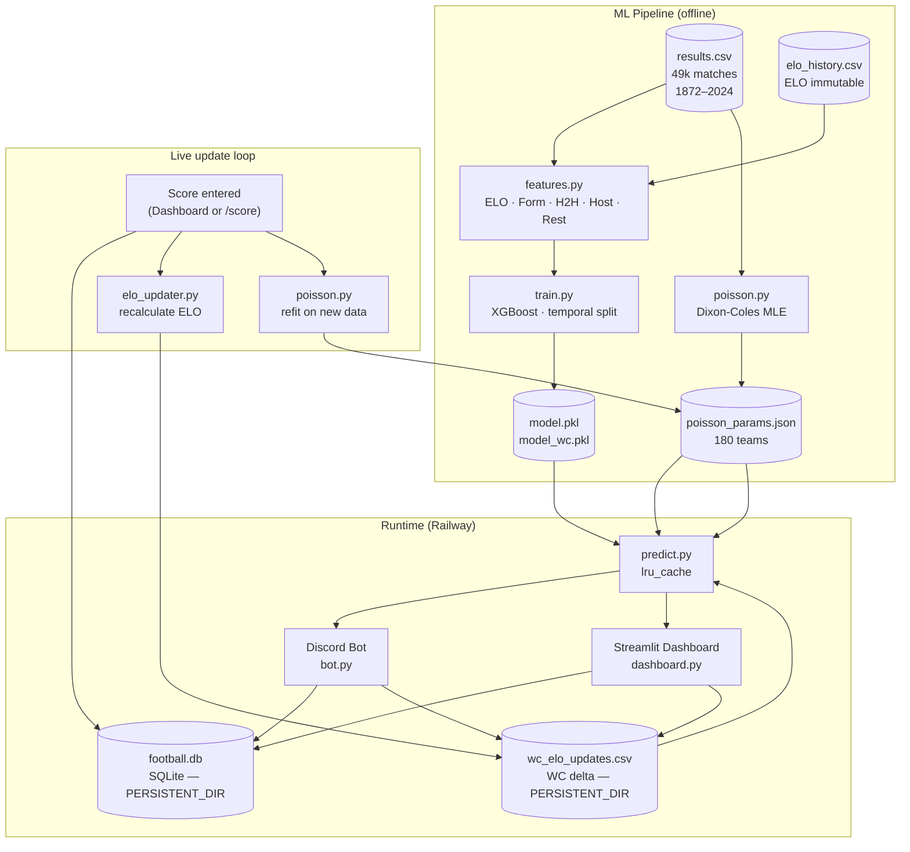

# WC 2026 Prediction Bot

Discord bot for World Cup 2026 match predictions, backed by a full ML pipeline trained on 150 years of international football data.

Built as a portfolio project targeting **ML / Data Engineering** roles.

---

## Architecture



---

## ML Models

Two models are used depending on context:

| Context | Model | Test accuracy |
|---|---|---|
| WC matches (`tournament_tier=4`) | Poisson Dixon-Coles | **54.7%** on WC 2022 |
| General matches | XGBoost | **55.2%** on 2022–2024 |

The Poisson model outperforms XGBoost on WC matches (+7.8 pp) because it captures individual attack/defense ratings per team — better suited for high-level tournaments.

### XGBoost features (20)

| Feature | Description |
|---|---|
| `elo_home`, `elo_away`, `elo_diff` | ELO computed from 1872, variable K-factor (40 WC / 30 qualifier / 20 friendly) |
| `home/away_form_pts/gf/ga` | Form over last 5 matches |
| `h2h_home_pts`, `h2h_gd`, `h2h_n` | Last 5 head-to-head meetings |
| `is_neutral`, `tournament_tier` | Match context |
| `home/away_is_host` | Home advantage for USA, Canada, Mexico |
| `home/away_wc_form_pts` | Win rate in major tournaments (tier ≥ 3) |
| `home/away_rest_days` | Days since last match (capped at 30) |

**No-leakage rule**: all features are computed with data strictly prior to each match (`shift(1)` before any `rolling()`). Temporal split only — no shuffle.

### Poisson — Dixon-Coles

```
λ_home = attack_home × defense_away × home_adv
```

- MLE fit on 2 477 competitive matches since 2018
- Individual attack/defense ratings for 180 teams
- Dixon-Coles τ correction on low scores (0-0, 1-0, 0-1, 1-1)
- Predicted score = argmax of score matrix **conditioned on XGBoost outcome**

### Temporal splits

| Model | Train | Val | Test |
|---|---|---|---|
| XGBoost general | < 2018 | 2018–2021 | 2022–2024 |
| XGBoost WC | WC 2002–2014 (256 matches) | WC 2018 | WC 2022 |

### Live ELO update

After each match score is entered:
1. Score saved to `match_results` → `/standings` updates
2. Prediction resolved in `predictions` → `/accuracy` updates
3. ELO recalculated and appended to `wc_elo_updates.csv`
4. `predict.py` cache cleared → next predictions use fresh ELO
5. Poisson model refit on new data → `poisson_params.json` updated

`elo_history.csv` (1872–2024) is **never modified**. `wc_elo_updates.csv` is the lightweight live delta.

---

## Discord Commands

| Command | Description |
|---|---|
| `/prono` | Select a KO round → pick a match → ML prediction + predicted score |
| `/simulate` | Monte Carlo (10 000 iterations) — WC winner probabilities from R16 |
| `/standings` | Live group table + upcoming match predictions |
| `/accuracy` | ML prediction accuracy on resolved matches |
| `/score` *(admin)* | Enter a match score → updates DB + ELO + refit Poisson |

---

## Admin Dashboard (Streamlit)

A Streamlit dashboard runs alongside the bot for admin visibility and score management.

| Page | Content |
|---|---|
| Overview | Key metrics: matches played, predictions resolved, accuracy |
| Predictions | Pending and resolved predictions with accuracy breakdown |
| ML Metrics | XGBoost accuracy / log-loss, Poisson params (home_adv, rho, top attack/defense) |
| Scores | Missing scores detection, recent results, score entry form |
| ELO | Current ELO ranking for all 48 WC teams + historical chart per team |
| Fixtures | Update "To be announced" team slots as KO rounds progress |

---

## Stack

| Layer | Technology |
|---|---|
| Discord bot | discord.py 2.3.2 |
| Dashboard | Streamlit 1.35 · Plotly 5.22 |
| ML | XGBoost 2.0.3 · scikit-learn 1.4.0 · scipy (MLE) |
| Data | pandas 2.2.0 |
| Database | SQLite (`predictions` + `match_results`) |
| Deployment | Railway — 2 services (bot + dashboard) sharing a `/data` volume |
| Runtime | Python 3.12 |

---

## Project Structure

```
predictions-football-bot/
│
├── bot.py                        # Discord client — 5 commands, prediction prefill on startup
├── database.py                   # SQLite — predictions, match_results, stats
├── dashboard.py                  # Streamlit entry point
│
├── commands/
│   ├── prono.py                  # /prono  — KO round selector → ML prediction + score
│   ├── simulate.py               # /simulate — Monte Carlo WC winner from R16
│   ├── standings.py              # /standings — live group table
│   ├── accuracy.py               # /accuracy — prediction accuracy stats
│   └── admin.py                  # /score — manual score entry (admin)
│
├── pages/                        # Streamlit multipage dashboard
│   ├── 1_Predictions.py
│   ├── 2_Metrics.py
│   ├── 3_Scores.py
│   ├── 4_ELO.py
│   └── 5_Fixtures.py
│
├── services/
│   ├── ml_model.py               # Format predict_match() output → Discord message
│   └── elo_updater.py            # Post-match ELO recalculation → wc_elo_updates.csv
│
└── ml/
    ├── pipeline.py               # Orchestrator: features → train → predictions
    ├── features.py               # Feature engineering (ELO, form, H2H, host, rest)
    ├── wc_features.py            # WC-specific features (FIFA rank, market value, titles)
    ├── train.py                  # XGBoost training — general + WC model
    ├── poisson.py                # Dixon-Coles Poisson — score prediction + live refit
    ├── predict.py                # Single-match inference (lru_cache on data + models)
    ├── simulator.py              # Monte Carlo — group stage + KO bracket
    └── data/
        ├── results.csv           # Mart Jürisoo dataset — 49k international matches
        ├── elo_history.csv       # ELO after every historical match (immutable)
        ├── wc2026_fixtures.csv   # WC 2026 schedule (104 matches)
        ├── wc2026_teams.csv      # FIFA name → dataset name mapping (48 teams)
        ├── wc_teams_train.csv    # WC features per team 2002–2022 (training)
        ├── wc_teams_test.csv     # WC 2026 features (inference only — never training)
        └── poisson_params.json   # Fitted Dixon-Coles parameters
```

---

## Local Setup

```bash
git clone <repo> && cd predictions-football-bot
python -m venv .venv && .venv\Scripts\activate   # Windows
pip install -r requirements.txt
```

Create `.env`:
```env
DISCORD_TOKEN=...
GUILD_ID=...        # optional — instant dev sync
```

Run:
```bash
python bot.py                                          # Discord bot
streamlit run dashboard.py                             # Admin dashboard
```

---

## Railway Deployment

Two services, same repo, same volume:

| Service | Start command | Role |
|---|---|---|
| `worker` | `python bot.py` | Discord bot |
| `web` | `streamlit run dashboard.py --server.port $PORT --server.headless true` | Admin dashboard |

Environment variables (both services):

| Variable | Description |
|---|---|
| `DISCORD_TOKEN` | Discord bot token |
| `GUILD_ID` | Server ID (optional) |
| `FOOTBALL_DATA_KEY` | football-data.org API key |
| `PERSISTENT_DIR` | `/data` — Railway volume mount path |

Both services must mount the **same volume** at `/data`. `football.db` and `wc_elo_updates.csv` live there and survive redeployments.

---

## License

MIT
